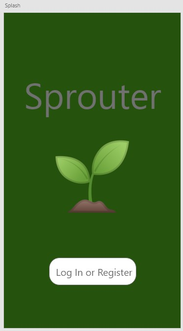
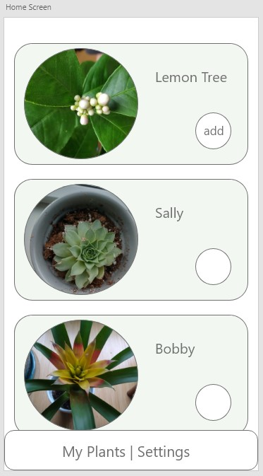

# Sprouter
## Rochelle Roberts  

## Description
Sprouter is an Android journaling app for plant lovers to document the growth and life of their plants. New growth! I created this app to explore React and to combine my love of plants with my passion for programming.

## Minimum Viable Product (MVP)
For Sprouter to be a useful journalling app, the following features define the MVP.
* Users can create a journal for each plant they want to track. 
* Users can have multiple plant journals and see the notes and photos for a particular plant.
* The app Home screen will display all of the user's plant journals. 
* Users can add photos to their journal by tapping on the "plus" button.
* Users can add notes about their plants.

## Beyond MVP
* It would be ideal if users can upload pictures of their plants to go along with the text.
* Host app, publish on Google Play Store
* Limit image size  -- or total image sizes
* Cost and scalability analysis
* Responsive UI design
* PC to phone sync
* Accessibility 
* Users can have multiple “books/channels” for journaling about each plant. 
* User authentication
* Make app work well on mobile --- styling for different screen sizes.
* Add tags for user to search their plants
* Make stories for plants, like before and after to show plant growth.
* Connect with Google Photos 
* Add reminders
* Create outdoor plant tag that is linked with weather API

## Technologies
`MVP`
* React Native
* Redux
* JavaScript
* Expo
* CSS
* Adobe XD for UI design  
`Beyond MVP` 
* Hosting app
* User Authentication
* Identity
* Weather API

## Design
These are rough mockups showing the general flow off the app. The full prototype can be experienced [here](https://xd.adobe.com/view/8783e05f-7a8e-45e8-4968-4bc4bbb9d99a-f1b2/), hosted by Adobe XD.

### Home Page
The home screen will display all of a user's plant journals. Flexbox and ScrollView. 

## Resources
Using [flex box](https://facebook.github.io/react-native/docs/flexbox) to manage the layouts.
* do column for top to bottom
* section List for pics by date

[scroll view](https://facebook.github.io/react-native/docs/scrollview.html) to render the list  

## Available Scripts

In the project directory, you can run:

### `npm start`

Runs the app in the development mode. 
Open the Expo page.

### `npm test`

Launches the test runner in the interactive watch mode. 
See the section about [running tests](https://facebook.github.io/create-react-app/docs/running-tests) for more information.

### `npm run build`

Builds the app for production to the `build` folder. 
It correctly bundles React in production mode and optimizes the build for the best performance.

The build is minified and the filenames include the hashes. 
Your app is ready to be deployed!

See the section about [deployment](https://facebook.github.io/create-react-app/docs/deployment) for more information.

