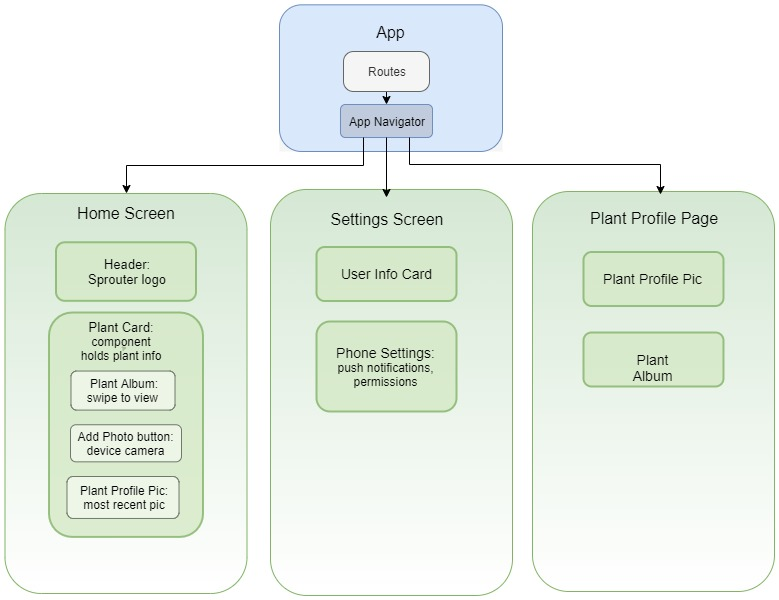

# Sprouter
### Rochelle Roberts
<br>

## Description
Sprouter is an Android journaling app for plant lovers to document the growth and life of their plants. New growth! I created this app to explore React Native and to combine my love of plants with my passion for programming.


## Minimum Viable Product (MVP)
For Sprouter to be a useful journaling app, the following features define the MVP.
* The app Home screen will display all of the user's plant journals. 
* Users can create a journal for each plant they want to track. 
* Users can have multiple plant journals and see the notes and photos for a particular plant.
* Users can add notes about their plants.
* Users can add photos to their journal by tapping on the "plus" button.

## Component Graph


## Beyond MVP
* Users can use their phone's camera to add new photos. 
* Users can use photos saved on their phone.
* Offline photos available 
* Cloud storage? AWS
* Host app, publish on Google Play Store
* Limit image size  -- or total image sizes
* Cost and scalability analysis
* Responsive UI design
* PC to phone sync
* Expo has support for facebook login
* Accessibility 
* Users can have multiple “books/channels” for journaling about each plant. 
* User authentication
* Make app work well on mobile --- styling for different screen sizes.
* Add tags for user to search their plants
* Make stories for plants, like before and after to show plant growth.
* Connect with Google Photos 
* Add reminders
* Create outdoor plant tag that is linked with weather API
* Testing

## Technologies
`MVP`
* React Native
* Redux
* JavaScript
* Expo
* Adobe XD for UI design
* Node.js
<br>
`Beyond MVP` 
* Hosting app
* User Authentication
* Identity
* Weather API

## Design
These mockups, created with Adobe XD, show the general design and flow of Sprouter. 

### Splash Screen
The splash screen will appear on opening the app. It will set the theme of the app. A  <br>


### Home Screen
After the splash screen, users will be routed to the home screen. This is where the app will display all of a user's plant journals. Users can quick add entries on this screen. Flexbox and ScrollView. <br>


### Plant Profile Screen ( or Component)
Each plant will have a profile page. Users can see the full history of the plant, add more photos and notes.

Current deciding how to display the details of a plant: either create a new page OR simply render a new component under the active plant card component. Thinking about state and native components. [link](https://medium.com/netscape/component-state-vs-redux-store-1eb0c929277)

### Settings Page
A place for users to manage notifications and general settings. 

### Navigation Style
Users can quickly navigate between the home, plant profiles and settings page by tapping on on the navigation tab at the bottom of the screen.


## Installing and Running Sprouter
From the project's root directory, run the following commands:

```sh
$ git clone https://github.com/rochellev/SprouterNative.git
$ cd  ./SprouterNative
$ npm install
$ npm start
```

After running the app, scan the QR code displayed in the terminal with the Expo app (Android) or the Camera app (iOS). Select `Tunnel` connection type on the Expo DevTool [localhost](http://localhost:19002/) if your device is not connected to the same network as your computer. Enjoy!

## About Rochelle Roberts
[LinkedIn](https://www.linkedin.com/in/rochelle-roberts)


## Resources
* Expo [image picker](https://docs.expo.io/versions/latest/sdk/imagepicker/) - provides access to system UI for selecting images and video from phones's library
* Using [flex box](https://facebook.github.io/react-native/docs/flexbox) to manage the layouts.
* looking into react native component [libraries](https://blog.bitsrc.io/11-react-native-component-libraries-you-should-know-in-2018-71d2a8e33312)
* A [guide](https://www.reactnative.guide/5-project-structure-and-start-building-some-app/5.2-basic-components-and-platform-specific-code.html)

* [React Native Elements](https://react-native-training.github.io/react-native-elements/docs/getting_started.html)
* [scroll view](https://facebook.github.io/react-native/docs/scrollview.html) to render the list  
